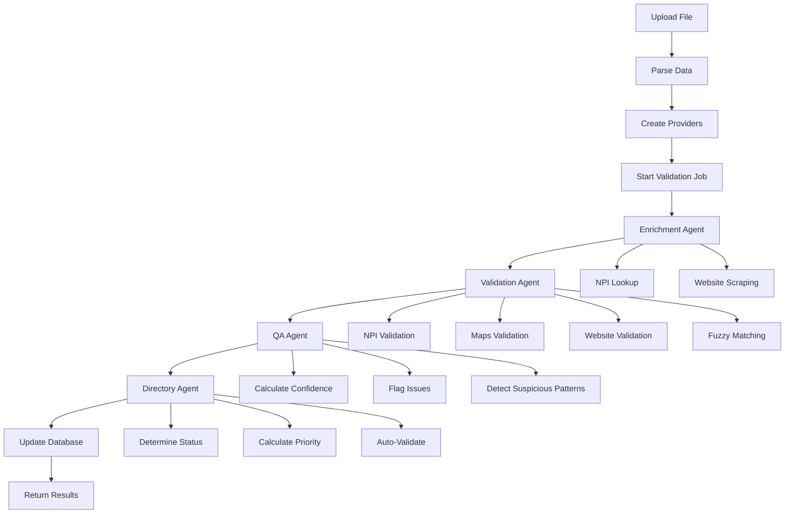

# System Architecture

## High-Level Architecture

```
┌─────────────────────────────────────────────────────────────┐
│                        Frontend (Next.js)                    │
│  ┌──────────┐  ┌──────────┐  ┌──────────┐                  │
│  │  Upload  │  │ Dashboard │  │  Review  │                  │
│  │   Page   │  │   Page    │  │   Modal  │                  │
│  └──────────┘  └──────────┘  └──────────┘                  │
│       │              │              │                        │
│       └──────────────┴──────────────┘                        │
│                        │                                      │
│              ┌─────────▼─────────┐                           │
│              │   API Client      │                           │
│              │   (React Query)   │                           │
│              └─────────┬─────────┘                           │
└────────────────────────┼─────────────────────────────────────┘
                         │ HTTP/REST
┌────────────────────────▼─────────────────────────────────────┐
│                    Backend (FastAPI)                          │
│  ┌──────────────────────────────────────────────────────┐   │
│  │                    API Routes                          │   │
│  │  /upload  /validation  /dashboard  /email             │   │
│  └────────────────┬─────────────────────────────────────┘   │
│                   │                                            │
│  ┌────────────────▼──────────────────────────────────────┐   │
│  │              Background Tasks                          │   │
│  │         (Validation Pipeline)                           │   │
│  └────────────────┬─────────────────────────────────────┘   │
│                   │                                            │
│  ┌────────────────▼──────────────────────────────────────┐   │
│  │            Agentic AI Pipeline                         │   │
│  │  ┌──────────────┐  ┌──────────────┐                  │   │
│  │  │ Enrichment   │→ │  Validation   │                  │   │
│  │  │    Agent     │  │     Agent     │                  │   │
│  │  └──────────────┘  └──────┬───────┘                  │   │
│  │                           │                             │   │
│  │  ┌──────────────┐  ┌─────▼───────┐                  │   │
│  │  │      QA       │← │  Directory   │                  │   │
│  │  │    Agent      │  │    Agent     │                  │   │
│  │  └──────────────┘  └──────────────┘                  │   │
│  └────────────────┬─────────────────────────────────────┘   │
│                   │                                            │
│  ┌────────────────▼──────────────────────────────────────┐   │
│  │              Services Layer                            │   │
│  │  ┌──────────┐  ┌──────────┐  ┌──────────┐            │   │
│  │  │   NPI    │  │   Maps    │  │ Website  │            │   │
│  │  │ Service  │  │  Service  │  │ Service  │            │   │
│  │  └──────────┘  └──────────┘  └──────────┘            │   │
│  └───────────────────────────────────────────────────────┘   │
│                   │                                            │
│  ┌────────────────▼──────────────────────────────────────┐   │
│  │              Database (SQLite)                         │   │
│  │  ┌──────────────┐  ┌──────────────┐                  │   │
│  │  │ ValidationJob│  │   Provider   │                  │   │
│  │  └──────────────┘  └──────────────┘                  │   │
│  └───────────────────────────────────────────────────────┘   │
└───────────────────────────────────────────────────────────────┘
```

## Agentic AI Pipeline Flow



## Data Flow

1. **Upload Phase**:
   - User uploads CSV/PDF → Backend saves file → Parses data → Creates ValidationJob and Provider records

2. **Validation Phase**:
   - Background task starts → Processes each provider through pipeline:
     - Enrichment: Fill missing data
     - Validation: Cross-verify with external sources
     - QA: Calculate scores and flag issues
     - Directory: Determine final status

3. **Display Phase**:
   - Frontend polls job status → Fetches providers → Displays in dashboard

## Component Interactions

### Frontend Components
- **UploadPage**: Handles file upload, calls `/api/upload/csv` or `/api/upload/pdf`
- **DashboardPage**: Polls `/api/validation/status/{job_id}` and `/api/dashboard/stats`
- **ProviderDetailModal**: Fetches provider details, generates email templates

### Backend Agents
- **EnrichmentAgent**: Uses NPI and Website services to fill gaps
- **ValidationAgent**: Uses NPI, Maps, and Website services for validation
- **QAAgent**: Analyzes confidence scores and flags issues
- **DirectoryAgent**: Makes final validation decisions

## Database Relationships

```
ValidationJob (1) ──< (N) Provider
Provider (1) ──< (N) ValidationLog
```

## External Services (Mock)

- **NPI Service**: Simulates NPI registry API calls
- **Maps Service**: Simulates Google Maps geocoding/validation
- **Website Service**: Simulates website scraping

## Security Considerations

- File upload size limits
- Input validation on all endpoints
- SQL injection protection via SQLAlchemy ORM
- CORS configuration for frontend access

## Scalability

- Async/await throughout for non-blocking operations
- Background tasks for long-running validations
- Database indexing on frequently queried fields
- Pagination for large provider lists


