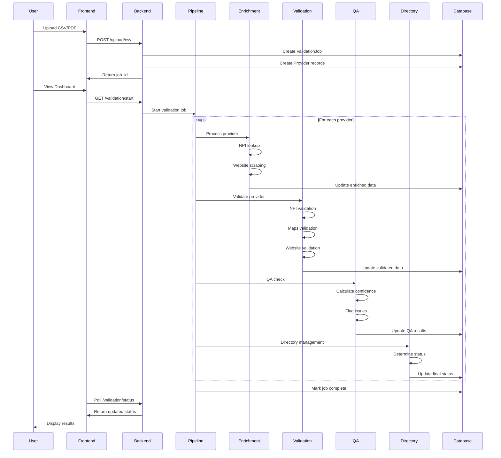
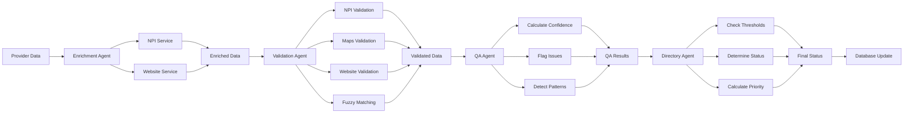
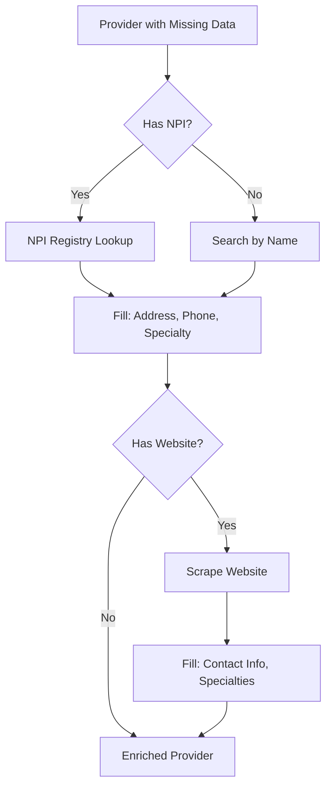
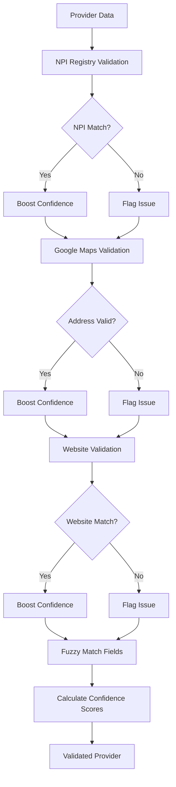
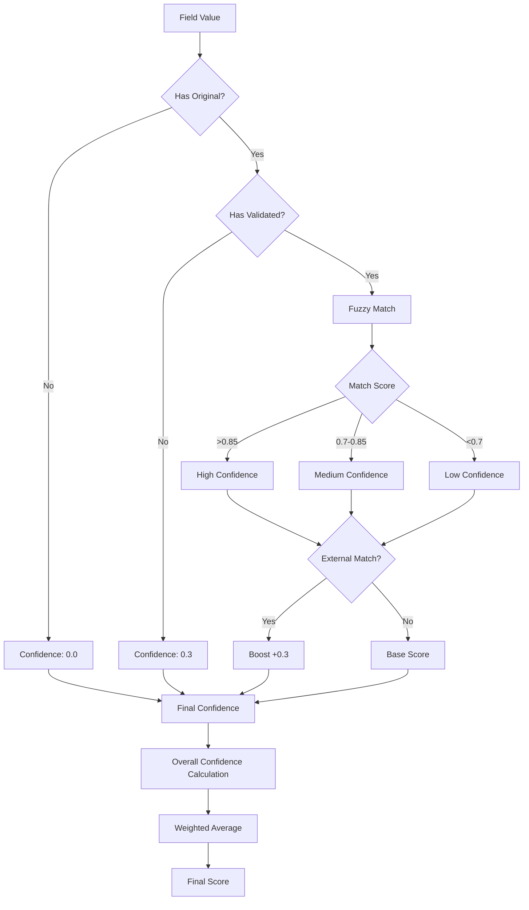
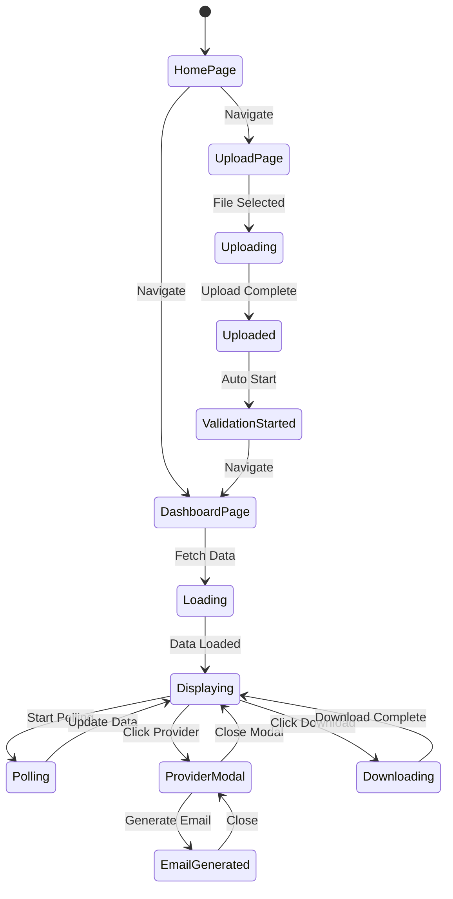

# System Flow Diagrams

## Complete Validation Flow

```mermaid
sequenceDiagram
    participant User
    participant Frontend
    participant Backend
    participant Pipeline
    participant Enrichment
    participant Validation
    participant QA
    participant Directory
    participant Database

    User->>Frontend: Upload CSV/PDF
    Frontend->>Backend: POST /upload/csv
    Backend->>Database: Create ValidationJob
    Backend->>Database: Create Provider records
    Backend->>Frontend: Return job_id
    
    User->>Frontend: View Dashboard
    Frontend->>Backend: GET /validation/start
    Backend->>Pipeline: Start validation job
    
    loop For each provider
        Pipeline->>Enrichment: Process provider
        Enrichment->>Enrichment: NPI lookup
        Enrichment->>Enrichment: Website scraping
        Enrichment->>Database: Update enriched data
        
        Pipeline->>Validation: Validate provider
        Validation->>Validation: NPI validation
        Validation->>Validation: Maps validation
        Validation->>Validation: Website validation
        Validation->>Database: Update validated data
        
        Pipeline->>QA: QA check
        QA->>QA: Calculate confidence
        QA->>QA: Flag issues
        QA->>Database: Update QA results
        
        Pipeline->>Directory: Directory management
        Directory->>Directory: Determine status
        Directory->>Database: Update final status
    end
    
    Pipeline->>Database: Mark job complete
    Frontend->>Backend: Poll /validation/status
    Backend->>Frontend: Return updated status
    Frontend->>User: Display results
```

## Agent Interaction Flow

```mermaid
graph LR
    A[Provider Data] --> B[Enrichment Agent]
    B --> B1[NPI Service]
    B --> B2[Website Service]
    B1 --> C[Enriched Data]
    B2 --> C
    
    C --> D[Validation Agent]
    D --> D1[NPI Validation]
    D --> D2[Maps Validation]
    D --> D3[Website Validation]
    D --> D4[Fuzzy Matching]
    D1 --> E[Validated Data]
    D2 --> E
    D3 --> E
    D4 --> E
    
    E --> F[QA Agent]
    F --> F1[Calculate Confidence]
    F --> F2[Flag Issues]
    F --> F3[Detect Patterns]
    F1 --> G[QA Results]
    F2 --> G
    F3 --> G
    
    G --> H[Directory Agent]
    H --> H1[Check Thresholds]
    H --> H2[Determine Status]
    H --> H3[Calculate Priority]
    H1 --> I[Final Status]
    H2 --> I
    H3 --> I
    
    I --> J[Database Update]
```

## Data Enrichment Flow

```mermaid
flowchart TD
    Start[Provider with Missing Data] --> CheckNPI{Has NPI?}
    CheckNPI -->|Yes| NPILookup[NPI Registry Lookup]
    CheckNPI -->|No| NameSearch[Search by Name]
    
    NPILookup --> FillNPI[Fill: Address, Phone, Specialty]
    NameSearch --> FillNPI
    
    FillNPI --> CheckWebsite{Has Website?}
    CheckWebsite -->|Yes| ScrapeWebsite[Scrape Website]
    CheckWebsite -->|No| End[Enriched Provider]
    
    ScrapeWebsite --> FillWebsite[Fill: Contact Info, Specialties]
    FillWebsite --> End
```

## Validation Flow

```mermaid
flowchart TD
    Start[Provider Data] --> ValidateNPI[NPI Registry Validation]
    ValidateNPI --> NPIResult{NPI Match?}
    NPIResult -->|Yes| BoostConfidence1[Boost Confidence]
    NPIResult -->|No| FlagIssue1[Flag Issue]
    
    BoostConfidence1 --> ValidateAddress[Google Maps Validation]
    FlagIssue1 --> ValidateAddress
    
    ValidateAddress --> AddressResult{Address Valid?}
    AddressResult -->|Yes| BoostConfidence2[Boost Confidence]
    AddressResult -->|No| FlagIssue2[Flag Issue]
    
    BoostConfidence2 --> ValidateWebsite[Website Validation]
    FlagIssue2 --> ValidateWebsite
    
    ValidateWebsite --> WebsiteResult{Website Match?}
    WebsiteResult -->|Yes| BoostConfidence3[Boost Confidence]
    WebsiteResult -->|No| FlagIssue3[Flag Issue]
    
    BoostConfidence3 --> FuzzyMatch[Fuzzy Match Fields]
    FlagIssue3 --> FuzzyMatch
    
    FuzzyMatch --> CalculateScores[Calculate Confidence Scores]
    CalculateScores --> End[Validated Provider]
```

## Confidence Scoring Flow

```mermaid
graph TD
    A[Field Value] --> B{Has Original?}
    B -->|No| C[Confidence: 0.0]
    B -->|Yes| D{Has Validated?}
    
    D -->|No| E[Confidence: 0.3]
    D -->|Yes| F[Fuzzy Match]
    
    F --> G{Match Score}
    G -->|>0.85| H[High Confidence]
    G -->|0.7-0.85| I[Medium Confidence]
    G -->|<0.7| J[Low Confidence]
    
    H --> K{External Match?}
    I --> K
    J --> K
    
    K -->|Yes| L[Boost +0.3]
    K -->|No| M[Base Score]
    
    L --> N[Final Confidence]
    M --> N
    C --> N
    E --> N
    
    N --> O[Overall Confidence Calculation]
    O --> P[Weighted Average]
    P --> Q[Final Score]
```

## Frontend State Flow

```mermaid
stateDiagram-v2
    [*] --> HomePage
    HomePage --> UploadPage: Navigate
    HomePage --> DashboardPage: Navigate
    
    UploadPage --> Uploading: File Selected
    Uploading --> Uploaded: Upload Complete
    Uploaded --> ValidationStarted: Auto Start
    ValidationStarted --> DashboardPage: Navigate
    
    DashboardPage --> Loading: Fetch Data
    Loading --> Displaying: Data Loaded
    Displaying --> Polling: Start Polling
    Polling --> Displaying: Update Data
    
    Displaying --> ProviderModal: Click Provider
    ProviderModal --> EmailGenerated: Generate Email
    EmailGenerated --> ProviderModal: Close
    ProviderModal --> Displaying: Close Modal
    
    Displaying --> Downloading: Click Download
    Downloading --> Displaying: Download Complete
```

